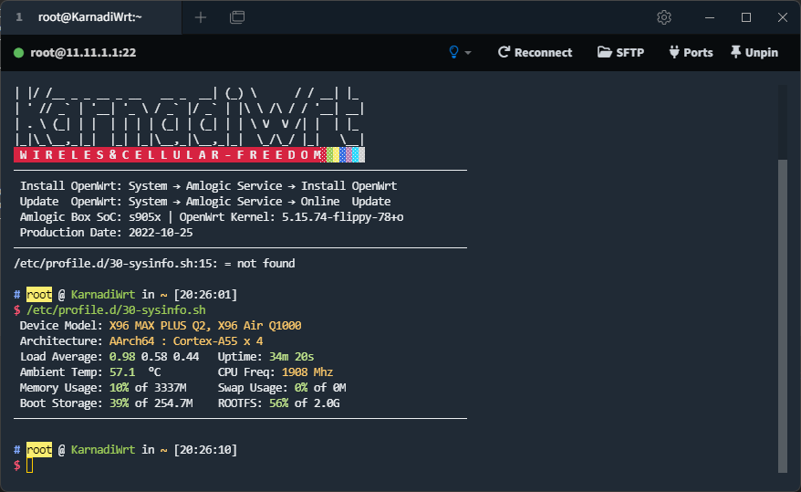
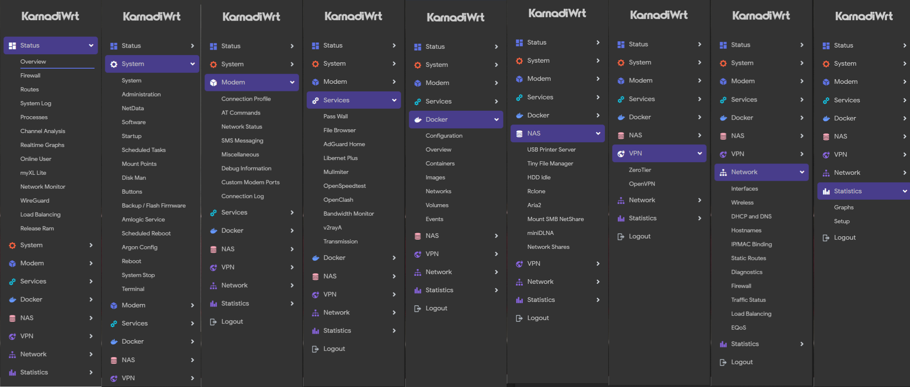

#  KarnadiWrt-21.02 for Amlogic
KarnadiWrt yaitu gabungan antara *firmware* [ImmortalWrt](https://github.com/immortalwrt/immortalwrt) yang mempunyai dukungan tambahan *package* yang banyak dan *firmware* [ROOter](https://github.com/ofmodemsandmen/ROOterSource2102) yang sangat cocok untuk modem rakitan seperti Fibocom l860-gl dan l850-gl. *Firmware* ini dikhususkan untuk perangkat Amlogic terutama X96 Max Plus 2, HG680 dan B860H. Jadi saya hanya akan *release* untuk perangkat s905x dan s905x3, jika ingin menggunakan di perangkat lain yang sesama Amlogic bisa dengan mengganti berkas *dtb* sesuai prosesor, untuk perangkat beda arsitektur bisa di *fork* *repository* ini dan ganti konfigurasi arsitektur setelah itu di *compile* sendiri.

## Sedikit Cerita
Kenapa saya membuat ini? Sebenarnya sudah banyak firmware di luar sana yang bagus, tapi setiap kali di coba di perangkat utama saya yaitu X96 Max Plus pasti selalu ada bug nya. Misal firmware om r3yr3, semua versi firmware dari AP, LE, SR saya tidak bisa mendapatkan alamat IP dari LAN, bahkan walau alamat IP sudah di atur manual, perangkat saya tidak bisa terhubung ke alamat IP STB. Saya sudah coba juga firmware helmiwrt tapi salah satu modem saya Qualcomm MDM9600 selalu reconnect. Firmware paling cocok di X96 Max Plus saya yaitu firmware immortalwrt yang di build oleh [lynxnexy](https://t.me/lynxnexy), tapi ada beberapa package yang saya butuhkan tidak ada jadi saya fork repository-nya dan saya tambahkan beberapa package sesuai kebutuhan saya. Tapi setelah saya membeli modem rakitan yaitu Fibocom L860-gl, firmware immortalwrt dari [lynxnexy](https://t.me/lynxnexy) tidak mendukungnya. Hanya firmware ROOter GoldenOrb yang mendukung modem rakitan. Firmware ROOter yg dibuild oleh radenku.com sama bugnya dengan firmware om r3yr3 dan helmiwrt, tidak bisa mendapatkan alamat IP dari LAN dan modem MDM9600 tidak didukung. Setelah pusing nyoba firmware ini itu pasti ada bug di perangkat saya, akhirnya saya melihat postingan om Asrofur Rizqi yang menggabungkan firmware ImmortalWrt dan ROOter, saya coba racikan beliau tapi ada bug di modem MDM9600 juga. Setelah baca instruksi beliau di kolom komentar tentang package apa yang dibutuhkan untuk build firmware ROOter, akhirnya saya coba menambahkan package ROOter di firmware ImmortalWrt racikan [lynxnexy](https://t.me/lynxnexy). Akhirnya setelah seharian coba compile firmware sendiri, saya berhasil. Semua modem saya Qualcomm MDM9600, Qualcomm MSM8916 dan Fibocom L860-gl bisa terdeteksi dan terkoneksi di X96 Max Plus saya.

## Informasi Firmware:
1. Ip bawaan: `11.11.1.1`
2. Nama pengguna bawaan: `root`
3. Kata sandi bawaan: `password`
4. Nama WiFi bawaan: `KarnadiWrt`
5. kata sandi bawaan: `kosong`

## Preview

## BUG
- Libernet belum bisa jalan

## TODO
- Rapikan Menu
- Fix libernet
- Tambahkan lebih banyak tema

## Troubleshoting
- fix PHP `wget -O /bin/fixphp "https://raw.githubusercontent.com/helmiau/openwrt-config/main/fix-xderm-libernet-gui" && chmod +x /bin/fixphp && fixphp`

## Kredit
- [immortalwrt](https://github.com/immortalwrt/immortalwrt)
- [unifreq](https://github.com/unifreq)
- [ophub](https://github.com/ophub)
- [lynxnexy](https://t.me/lynxnexy)
- [r3yr3](https://www.youtube.com/c/IndonesianTechChannel)
- [helmiau](https://github.com/helmiau)
- [OpenWrt](https://github.com/openwrt/openwrt)
- [coolsnowwolf/lede](https://github.com/coolsnowwolf/lede)
- [haiibo](https://github.com/haiibo)